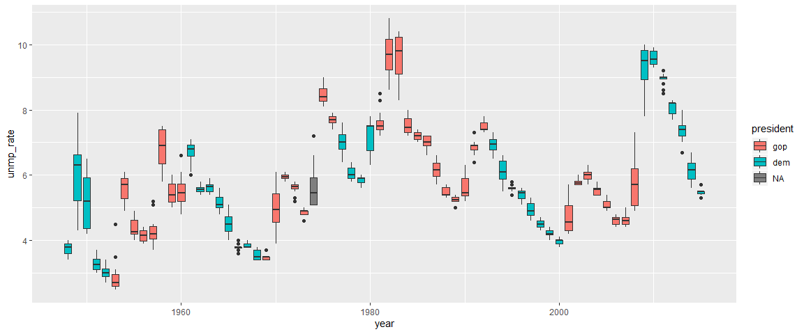
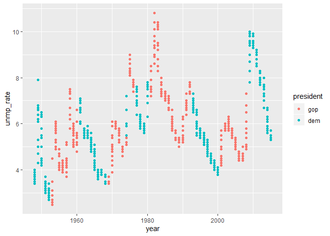
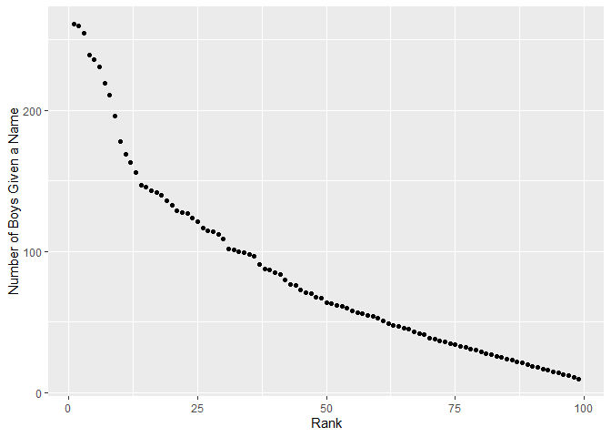

p8105\_hw2\_jsg2145
================
Jared Garfinkel
9/27/2019

## Homework 2

### Problem 1

``` r
mr_trash = readxl::read_excel("./data/Trash-Wheel-Collection-Totals-8-6-19.xlsx", 
                              sheet = "Mr. Trash Wheel", 
                              range = readxl::cell_cols("A:N")) %>% 
  janitor::clean_names() %>% 
  filter(!is.na(dumpster)) %>% 
  mutate(
    sports_balls = 
      round(sports_balls, digits = 0) %>% 
      as.integer())
```

``` r
precip_18 = readxl::read_excel("./data/Trash-Wheel-Collection-Totals-8-6-19.xlsx",
                              sheet = "2018 Precipitation", range = readxl::cell_rows(2:14)) %>% 
  janitor::clean_names() %>% 
  filter(!is.na(total)) %>% 
  mutate(year = 2018)

precip_17 = readxl::read_excel("./data/HealthyHarborWaterWheelTotals2018-7-28.xlsx",
                               sheet = "2017 Precipitation", range = readxl::cell_rows(2:14)) %>% 
  janitor::clean_names() %>% 
  filter(!is.na(total)) %>% 
  mutate(year = 2017)
```

``` r
precip1718 = full_join(precip_17, precip_18) %>% 
  mutate(
    month = month.name[month])
```

    ## Joining, by = c("month", "total", "year")

#### Problem 1 summary I

The Mr. Trash Wheel data is the data collected from a skimmer

that collects debris in a bay in Maryland. For instance, the median
number

of sports ball collected in 2017 was 8. The volume and weight of

the debris collected appear to be rising over the period of the data,

from 2014 to 2018. Interestingly, this trend does not appear in each

category of waste. Most of the debris variables peaked in 2016 or simply

tapered off after the first year.

One variable that shows this increasing trend over time is “Homes
Powered”,

which is a measurementof the power generated by a waste-to-energy plant.
However,

the number of dumpsters also increased over time. One explanation for

this is that the tare weight was off, creating a situation where

each time a dumpster was weighed, it overestimated the total

weight collected. Another one is that the amount of stuff being

collected was underestimated for some reason. I’m not really sure

what’s going on here.

It might have something to do with the way the volume is measured.

There is a cluster of volume measurements at 15 cubic yards and

about 18 cubic yards. The density of the weights (calculated from

the weight and volume of debris) appears not to change over time. One
might

expect the density to rise over time, considering the amount of stuff
being collected

doesn’t appear to follow the same rising trend. This would indicate that
despite

not collecting more stuff, more dense stuff was collected. However, this
is not the case.

See below.

``` r
mr_trash %>% 
  ggplot(aes(x = volume_cubic_yards)) +
  geom_histogram() +
  labs(x = "Volume (Cubic Yards)",
       y = "Count")
```

    ## `stat_bin()` using `bins = 30`. Pick better value with `binwidth`.

<!-- -->

``` r
mr_trash %>% 
  ggplot(aes(x = year, y = weight_tons / volume_cubic_yards, group = year)) +
  geom_boxplot() +
  labs(x = "Year",
       y = "Density (Weight (tons)/Volume (cubic yards))")
```

<!-- -->

``` r
mr_trash %>% 
  ggplot(aes(x = year, y = weight_tons)) +
  geom_col() +
  labs(x = "Year",
       y = "Weight (tons)")
```

<!-- -->

``` r
mr_trash %>% 
  ggplot(aes(x = year, y = volume_cubic_yards)) +
  geom_col() +
  labs(x = "Year",
       y = "Volume (cubic yards")
```

<!-- -->

#### Problem 1 summary II

The precipitation data show the rain that fell in each month from
January

to December in 2017 and 2018. The total precipitation in 2018

was 70.33. The total precipitation

in 2017 was 32.93. See below.

``` r
precip1718 %>% 
  filter(year == 2017) %>% 
  mutate(
    month = factor(month, levels = month.name)) %>% 
  ggplot(aes(x = month, y = total)) +
  geom_col() +
  labs(
    x = "Month",
    y = "Total Precipitation (inches)"
  )
```

<!-- -->

``` r
precip1718 %>% 
  filter(year == 2018) %>% 
  mutate(
    month = factor(month, levels = month.name)) %>% 
  ggplot(aes(x = month, y = total)) +
  geom_col() +
  labs(
    x = "Month",
    y = "Total Precipitation (inches)"
  )
```

<!-- -->

## Problem 2

``` r
polls = read_csv(file = "./data/pols-month.csv") %>% 
  separate(mon, c("year", "month", "day"), "-") %>% 
  mutate(
    month = as.numeric(month),
    month = month.name[month],
    month = factor(month, levels = month.name),
    year = as.numeric(year),
    president = ifelse(prez_gop == 1, "gop", "dem")) %>% 
  arrange(year, month) %>% 
  select(year, month, gov_gop, sen_gop, rep_gop, gov_dem, sen_dem, rep_dem, president)
```

    ## Parsed with column specification:
    ## cols(
    ##   mon = col_date(format = ""),
    ##   prez_gop = col_double(),
    ##   gov_gop = col_double(),
    ##   sen_gop = col_double(),
    ##   rep_gop = col_double(),
    ##   prez_dem = col_double(),
    ##   gov_dem = col_double(),
    ##   sen_dem = col_double(),
    ##   rep_dem = col_double()
    ## )

``` r
snp = read_csv(file = "./data/snp.csv") %>% 
  separate(date, 
           c("month", "day", "year"), "/") %>% 
  mutate(
    month = as.numeric(month),
    month = month.name[month],
    month = factor(month, levels = month.name),
    year = as.numeric(year)) %>% 
  arrange(year, month) %>% 
  select(year, month, close)
```

    ## Parsed with column specification:
    ## cols(
    ##   date = col_character(),
    ##   close = col_double()
    ## )

``` r
unmp = read_csv(file = "./data/unemployment.csv") %>% 
  pivot_longer(
    c(2:13), 
    names_to = "month") %>% 
  janitor::clean_names() %>% 
  mutate(
    month = match(month, month.abb), 
    month = month.name[month])
```

    ## Parsed with column specification:
    ## cols(
    ##   Year = col_double(),
    ##   Jan = col_double(),
    ##   Feb = col_double(),
    ##   Mar = col_double(),
    ##   Apr = col_double(),
    ##   May = col_double(),
    ##   Jun = col_double(),
    ##   Jul = col_double(),
    ##   Aug = col_double(),
    ##   Sep = col_double(),
    ##   Oct = col_double(),
    ##   Nov = col_double(),
    ##   Dec = col_double()
    ## )

``` r
join1 = full_join(polls, snp, by = c("year", "month")) %>% 
  rename(snp_close = close)
join2 = full_join(join1, unmp, by = c("year", "month")) %>% 
  rename(unmp_rate = value)
```

    ## Warning: Column `month` joining factor and character vector, coercing into
    ## character vector

``` r
join2 %>% 
  filter(
    !is.na(unmp_rate)) %>% 
  mutate(
    president = 
      factor(president, 
             levels = c("gop", "dem"),
             labels = c("Republican", "Democrat"))) %>%
  ggplot(aes(x = year, y = unmp_rate, fill = president, group = year)) +
  geom_boxplot() +
  labs(x = "Year",
       y = "Unemployment Rate (%)") +
  theme(legend.position = "bottom") +
  scale_fill_discrete(name = "President")
```

<!-- -->

``` r
join2 %>% 
  filter(
    !is.na(snp_close)) %>% 
  ggplot(aes(x = year, y = snp_close)) +
  geom_smooth(se = FALSE) +
  labs(x = "Year",
       y = "S&P 500 Closing Price")
```

    ## `geom_smooth()` using method = 'loess' and formula 'y ~ x'

<!-- -->

#### Problem 2 summary

The pols-months dataset gives a detailed count of the republican and

democratic senators, representatives, and governors. There were 822

months of data, with 9 variables. The snp dataset is

the closing price of the S\&P 500 for each month from 1950 to 2015.

The S\&P 500 rose since the beginning of the

data collection. The unemployment dataset gives the unemployment rate
for

each month from 1948 to 2015.

The three datasets together cover the period from 1948 to 2015.

The dataframe is 828 rows by 11 columns. A visual above shows

the changes to the unemployment rate in years during which the president
was from the

Democratic Party or the GOP. The average unemployment rate over the
period of

data collection is 5.83.

## Problem 3

``` r
bbnm = read_csv(file = "./data/Popular_Baby_Names.csv") %>% 
  janitor::clean_names() %>% 
  rename(year = year_of_birth,
         fname = childs_first_name) %>% 
  mutate(fname = toupper(fname),
         ethnicity = 
           recode(ethnicity, 
                  "ASIAN AND PACI" = "ASIAN AND PACIFIC ISLANDER",
                  "BLACK NON HISP" = "BLACK NON HISPANIC",
                  "WHITE NON HISP" = "WHITE NON HISPANIC")) %>% 
  distinct()
```

    ## Parsed with column specification:
    ## cols(
    ##   `Year of Birth` = col_double(),
    ##   Gender = col_character(),
    ##   Ethnicity = col_character(),
    ##   `Child's First Name` = col_character(),
    ##   Count = col_double(),
    ##   Rank = col_double()
    ## )

``` r
bbnm %>% 
  group_by(year, gender) %>% 
  mutate(
    rank = desc(count) %>% 
      min_rank()) %>% 
  ungroup() %>% 
  rename(Ethnicity = ethnicity,
         Rank = rank) %>% 
  filter(fname == "OLIVIA") %>% 
  select(year, Ethnicity, Rank) %>% 
  arrange(year) %>% 
  pivot_wider(
    names_from = year,
    values_from = Rank
  ) %>% 
  knitr::kable(caption = "Popularity of the Name Olivia")
```

| Ethnicity                  | 2011 | 2012 | 2013 | 2014 | 2015 | 2016 |
| :------------------------- | ---: | ---: | ---: | ---: | ---: | ---: |
| ASIAN AND PACIFIC ISLANDER |   51 |   27 |   36 |   21 |   10 |   15 |
| BLACK NON HISPANIC         |  112 |   95 |   81 |  115 |   62 |  125 |
| HISPANIC                   |   53 |   63 |   55 |   42 |   46 |   37 |
| WHITE NON HISPANIC         |    5 |    7 |    4 |    4 |    4 |    3 |

Popularity of the Name Olivia

``` r
bbnm %>% 
  group_by(year, ethnicity) %>% 
  filter(gender == "MALE", rank == 1) %>% 
  rename(Ethnicity = ethnicity) %>% 
  select(year, Ethnicity, fname) %>% 
  ungroup() %>% 
  arrange(year) %>% 
  pivot_wider(
    names_from = year,
    values_from = fname
  ) %>% 
  knitr::kable(caption = "Most Popular Names for Boys")
```

| Ethnicity                  | 2011    | 2012   | 2013   | 2014   | 2015   | 2016   |
| :------------------------- | :------ | :----- | :----- | :----- | :----- | :----- |
| ASIAN AND PACIFIC ISLANDER | ETHAN   | RYAN   | JAYDEN | JAYDEN | JAYDEN | ETHAN  |
| BLACK NON HISPANIC         | JAYDEN  | JAYDEN | ETHAN  | ETHAN  | NOAH   | NOAH   |
| HISPANIC                   | JAYDEN  | JAYDEN | JAYDEN | LIAM   | LIAM   | LIAM   |
| WHITE NON HISPANIC         | MICHAEL | JOSEPH | DAVID  | JOSEPH | DAVID  | JOSEPH |

Most Popular Names for Boys

``` r
bbnm %>% 
  filter(gender == "MALE", ethnicity == "WHITE NON HISPANIC", year == "2016") %>% 
  mutate(Rank = rank) %>% 
  ggplot(aes(x = Rank, y = count)) +
  geom_point() +
  labs(y = "Number of Boys Given a Name")
```

<!-- -->
