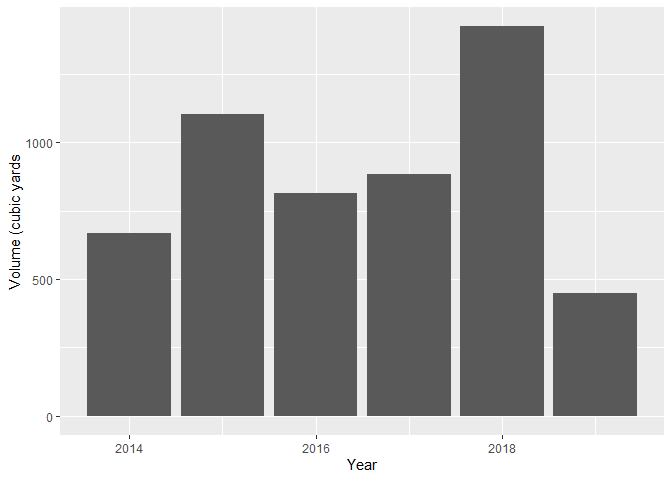
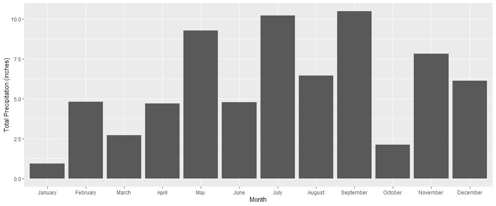

p8105\_hw2\_jsg2145
================
Jared Garfinkel
9/27/2019

## Homework 2

### Problem 1

``` r
mr_trash = readxl::read_excel("./data/HealthyHarborWaterWheelTotals2018-7-28.xlsx", 
                              sheet = "Mr. Trash Wheel", 
                              range = readxl::cell_cols("A:N")) %>% 
  janitor::clean_names() %>% 
  filter(!is.na(dumpster)) %>% 
  mutate(
    sports_balls = 
      round(sports_balls, digits = 0) %>% 
      as.integer())
```

``` r
precip_18 = readxl::read_excel("./data/HealthyHarborWaterWheelTotals2018-7-28.xlsx",
                              sheet = "2018 Precipitation", range = readxl::cell_rows(2:14)) %>% 
  janitor::clean_names() %>% 
  filter(!is.na(total)) %>% 
  mutate(year = 2018)

precip_17 = readxl::read_excel("./data/HealthyHarborWaterWheelTotals2018-7-28.xlsx",
                               sheet = "2017 Precipitation", range = readxl::cell_rows(2:14)) %>% 
  janitor::clean_names() %>% 
  filter(!is.na(total)) %>% 
  mutate(year = 2017)
```

``` r
precip1718 = full_join(precip_17, precip_18) %>% 
  mutate(
    month = month.name[month])
```

    ## Joining, by = c("month", "total", "year")

## Problem 1 summary

#### The Mr. Trash Wheel data is the data collected from a skimmer that collects debris in a bay in Maryland.The volume and weight of the debris collected appear to be rising over the period of the data, from 2014 to 2018. Interestingly, this trend does not appear in each category of waste. Most of the variables peaked in 2016 or simply tapered off after the first year. One variable that shows this increasing trend over time is “Homes Powered”, which is a measurement of the power generated by a waste-to-energy plant. However, the number of dumpsters also increased over time. One explanation for this is that the tare weight was off, creating a situation where each time a dumpster was weighed, it overestimated the total weight collected. Another one is that the amount of stuff being collected was underestimated. I’m not really sure what’s going on here. It might have something to do with the way the volume is measured. There is a cluster of volume measurements at 15 cubic yards and about 18 cubic yards. The density of the weights appears to stay the same over time.

``` r
mr_trash %>% 
  ggplot(aes(x = volume_cubic_yards)) +
  geom_histogram()
```

    ## `stat_bin()` using `bins = 30`. Pick better value with `binwidth`.

<!-- -->

``` r
mr_trash %>% 
  ggplot(aes(x = year, y = weight_tons / volume_cubic_yards, group = year)) +
  geom_boxplot()
```

<!-- -->

``` r
mr_trash %>% 
  ggplot(aes(x = year, y = weight_tons)) +
  geom_col()
```

<!-- -->

``` r
mr_trash %>% 
  ggplot(aes(x = year, y = volume_cubic_yards)) +
  geom_col()
```

<!-- -->

#### The precipitation data appears to show that there is less precipitation in June than in May. The total precipitation in 2018 from January to July was 23.5. The total precipitation in 2017 during the same period was 25.49.

``` r
precip1718 %>% 
  filter(year == 2017) %>% 
  mutate(months = factor(month, levels = month.name)) %>% 
  ggplot(aes(x = months, y = total)) +
  geom_col()
```

<!-- -->

``` r
precip1718 %>% 
  filter(year == 2018) %>% 
  mutate(months = factor(month, levels = month.name)) %>% 
  ggplot(aes(x = months, y = total)) +
  geom_col()
```

<!-- -->

## Problem 2

``` r
polls = read_csv(file = "./data/pols-month.csv") %>% 
  separate(mon, c("year", "month", "day"), "-") %>% 
  mutate(
    month = as.numeric(month),
    month = month.name[month]) %>% 
  mutate(
    president = ifelse(prez_gop == 1, "gop", "dem")) %>% 
  mutate(month = factor(month, levels = month.name)) %>% 
  arrange(year, month) %>% 
  select(year, month, gov_gop, sen_gop, rep_gop, gov_dem, sen_dem, rep_dem, president)
```

    ## Parsed with column specification:
    ## cols(
    ##   mon = col_date(format = ""),
    ##   prez_gop = col_double(),
    ##   gov_gop = col_double(),
    ##   sen_gop = col_double(),
    ##   rep_gop = col_double(),
    ##   prez_dem = col_double(),
    ##   gov_dem = col_double(),
    ##   sen_dem = col_double(),
    ##   rep_dem = col_double()
    ## )

``` r
snp = read_csv(file = "./data/snp.csv") %>% 
  separate(date, c("month", "day", "year"), "/") %>% 
  mutate(
    month = as.numeric(month),
    month = month.name[month],
    month = factor(month, levels = month.name)) %>% 
  arrange(year, month) %>% 
  select(year, month, close)
```

    ## Parsed with column specification:
    ## cols(
    ##   date = col_character(),
    ##   close = col_double()
    ## )
